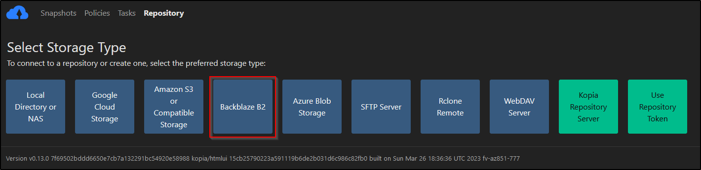
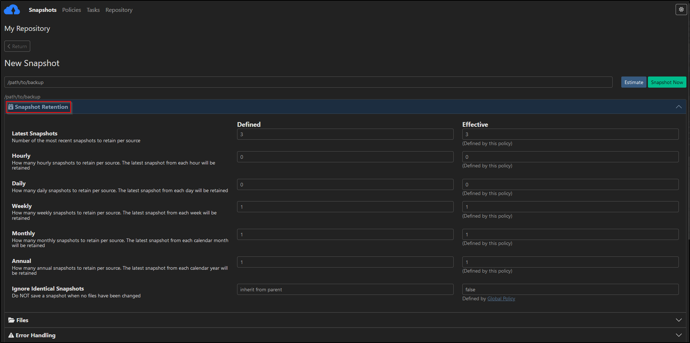

# Backing up docker data using Kopia

Why Kopia? It supports

- Encryption out of the box
- Decent WebUI
- Incremental backups
- Deduplication
- Compression, which can save quite a bit of space
- Snapshots taken can be mounted and the files can be inspected

Initially I started with a docker setup, but since for my use-case kopia required root access, it would be simpler to use install it on the host
Download the binary on the host system using yay, else download a pre built binary from [kopia releases](https://github.com/kopia/kopia/releases)

```shell
yay -S kopia-bin
```

## Setup Kopia

Create a password file for kopia to use with its config using `htpasswd`

```bash
> _ htpasswd -c /root/kopiap.txt kopia
New password:
Re-type new password:
Adding password for user kopia
> _ cat /root/kopiap.txt
kopia:$apr1$gpVct.4W$Koq0PYwvRTsxx1I36M6o30
```

Start a kopia server, which will expose port 51515

```bash
_ kopia server start --tls-generate-cert --htpasswd-file /root/kopiap.txt --address https://0.0.0.0:51515 --enable-actions
```

```bash
> _ kopia server start --tls-generate-cert --htpasswd-file /root/kopiap.txt --address https://0.0.0.0:51515 --enable-actions

Server will allow connections from users whose accounts are stored in the repository.
User accounts can be added using 'kopia server user add'.

SERVER CERT SHA256: 5f4294cfa1689fe9603cc8d26f67ff12f6ec64c4875d10bf4b5ee34fe29f9f8e
SERVER ADDRESS: https://[::]:51515
Open the address above in a web browser to use the UI.
```

The `--tls-generate-cert` is used to generate SSl certs

Visiting `https://hostname:51515` gives a password prompt. Use kopia as the username and password setup earlier

## Setup BackBlaze for storage

Currently going with BackBlaze B2 buckets as the storage type since they have a decent free tier

Navigate to Account -> Application Keys and create a new key

Now, navigate to repositories in the Kopia WebUI and select BackBlaze B2 to setup a new one


Add the necessary details like bucket name, bucket ID, application key and the storage for the repository is set up

## Set snapshot policies

Navigate to `/snapshots` to setup a new snapshot and corresponding policy

List global policy

```bash
> _ kopia policy show --global
```

Add the path to directory to backup, then define necessary policies

- retention policy
- file ignore list
- compression algorithm
- scheduling
- Pre and post snapshot actions

_file retention_


_scheduling snapshots_


For some reason the pre and post snapshot script config doesn't work with the WebUI, so set that manually via CLI

First change the `enableActions` option to _true_ in the repository config to enable actions on the server, and restart the kopia server

```bash
> _ cat /root/.config/kopia/repository.config
{
  "storage": {
    "type": "b2",
    "config": {
      "bucket": "name",
      "keyID": "ID",
      "key": "Key"
    }
  },
  "caching": {
    "cacheDirectory": "../../.cache/kopia/d0743e5f08747aef",
    "maxCacheSize": 5242880000,
    "maxMetadataCacheSize": 5242880000,
    "maxListCacheDuration": 30
  },
  "hostname": "hostname",
  "username": "root",
  "description": "My Repository",
  "enableActions": true,
  "formatBlobCacheDuration": 900000000000
}
```

Now the script can be added

```bash
> _ kopia --config-file=/root/.config/kopia/repository.config policy list
[sudo] password for abraxas:
c8f2e632bdace7072c9682ddd38b51d3 (global)
d67a0394619e3a8b14662e656ecadc72 root@niflheim:/opt

> _ kopia --config-file=/root/.config/kopia/repository.config policy set "root@niflheim:/opt" --before-snapshot-root-action /root/.config/kopia/pre-snapshot.sh --after-snapshot-root-action /root/.config/kopia/post-snapshot.sh
Setting policy for root@niflheim:/opt
 - setting before-snapshot-root (essential) action command to "/root/.config/kopia/pre-snapshot.sh" and timeout 5m0s
 - setting after-snapshot-root (essential) action command to "/root/.config/kopia/post-snapshot.sh" and timeout 5m0s
```

Since I am backing up docker bind volumes, I need to stop the containers in order to avoid any corruption.

This script gets a list of all running docker container's ID and pauses all of them.
TO manage them better, using docker labels
`pre-snapshot.sh`

```bash
#! /usr/bin/env bash

backup_label=kopia_backup
containers_to_backup=( $(docker ps --filter "label=$backup_label" -q) )

for container in "${containers_to_backup[@]}"
do
    docker unpause "$container"
done

```

A similar script unpauses the containers once the snapshot is done

## Restoring Snapshots

List all available snapshots

```bash
> _ kopia --config-file=/root/.config/kopia/repository.config snapshot list "root@niflheim:/opt"
root@niflheim:/opt
  2023-05-04 08:55:59 IST kce35287c0278cf454791fda0c2e1dc3a 1.6 GB drwxr-xr-x files:8964 dirs:6206 (latest-2)
  2023-05-04 09:36:49 IST k34ce585fdef02de4fb91eb9126164542 1.6 GB drwxr-xr-x files:8965 dirs:6206 (latest-1,weekly-1,monthly-1,annual-1)
```

List a specific snapshot

```bash
> _ kopia ls -l kce35287c0278cf454791fda0c2e1dc3a
drwxr-xr-x     50530686 2023-05-03 05:02:34 IST kccc4af0d4c33222403a7760ab5c65679  ghostfolio/
drwxr-xr-x   1310263088 2023-05-04 08:55:53 IST kcf7fbac00ac19f2095bf6e8dbbf2e17f  jellyfin/
drwxr-xr-x     29664690 2023-05-04 08:56:00 IST k0d4fe2a913950b2b133d1ca74e114e95  pihole/
drwxrwxrwx         1172 2023-04-30 22:09:06 IST k68277d1f69bda3178296508aba84ba0e  portainer_api/
drwxr-xr-x            0 2023-04-29 03:31:48 IST k13084fe1b52edafe1466f778e3de7c7c  calibre-web/
drwxr-xr-x        65666 2023-05-04 08:52:35 IST kca4c93ad4c85da05fd38df30ccadf733  filebrowser/
drwxrwxrwx      1055202 2023-05-04 08:51:15 IST k1719ef7c531422015a707eb733a53bee  grafana/
drwxr-xr-x          772 2023-04-29 06:59:17 IST k5247b634f29c62f0fc1b79a6333e3cd4  cloudflare-tunnel/
drwxr-xr-x        12730 2023-05-04 08:55:59 IST kd5821b5e5e064ba9d74be3675f2fffed  tailscale-vpn/
drwxr-xr-x            0 2023-04-29 03:21:49 IST kbf06c036b4cd572d0a74fed5c12e82e6  vscode/
drwxr-xr-x            0 2023-04-29 03:38:03 IST k4e4661e3698fb66003efd701e76272fe  wireguard/
drwxr-xr-x       128897 2023-05-04 08:42:21 IST kcb2f9cd1fddbe0565df3f8409a5d7c6a  ngnix-proxy-manager/
drwxr-xr-x    181852612 2023-05-04 08:56:31 IST kf106a4f084a2eba5cc576e24ab12b155  prometheus/
drwxr-xr-x       599200 2023-05-04 08:55:08 IST k708f0311d4c507a3f44410fbdce95f01  uptime-kuma/
```

Comparing snapshots

```bash
> _ kopia diff kce35287c0278cf454791fda0c2e1dc3a k34ce585fdef02de4fb91eb9126164542
./grafana modification times differ:  2023-05-04 08:51:15.608140597 +0530 IST 2023-05-04 09:36:09.93607729 +0530 IST
./grafana/grafana.db modification times differ:  2023-05-04 08:51:15.608140597 +0530 IST 2023-05-04 09:36:09.93607729 +0530 IST
changed ./grafana/grafana.db at 2023-05-04 09:36:09.93607729 +0530 IST (size 1052672 -> 1052672)
./prometheus sizes differ:  181852612 182253592
```

Mounting snapshots on local filesystem

```bash
_ mkdir -p /tmp/kopia
_ kopia mount kb9a8420bf6b8ea280d6637ad1adbd4c5 /tmp/kopia &
_ ls -la /tmp/kopia
```

The files can now be examined on the local filesystem. This can also be used to restore the snapshot

Restoring a snapshot using the **restore** command

```bash
_ kopia restore kb9a8420bf6b8ea280d6637ad1adbd4c5 path/to/restore/to
```

or

```bash
_ kopia restore kb9a8420bf6b8ea280d6637ad1adbd4c5/sub_directory/to/restore  path/to/restore/to
```

Helpful flags

- `--consistent-attributes` -> restore fails if the snapshot inconsistent attributes
- `--no-overwrite-files --no-overwrite-directories --no-overwrite-symlinks` -> To prevent overwriting
- `--log-dir="/root/.cache/kopia`
- `--log-level=debug`

## ToDo

- [ ] Add notifications for snapshot events
- [ ] Add Images
- [ ] Add cronjob to start the server automatically
